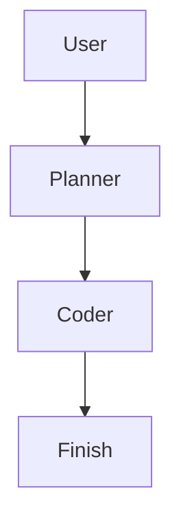
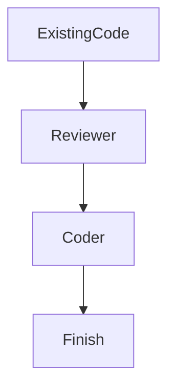

copilot-agentic-workflows

This repository imports and adapts the original three-agent gist by Burke Holland (see attribution below) into a small, opinionated agentic workflow suitable for iterative code design and review.

Agentic architecture

- Orchestrators coordinate a set of specialized agents:
  - planner: decomposes tasks into steps and creates plans
  - coder: implements code artifacts from plan items
  - code_reviewer: reviews code produced by the coder for style, correctness, and testability
  - debug: runs through debugging and triage steps
  - designer: helps with UX/architecture decisions
  - context7: provides reference documentation lookups

- Two orchestrators are included in this repository (see below). Each orchestrator demonstrates a different composition for multi-agent workflows: planning+implementation and review-focused flows.

Orchestrators

- orchestrator-1 (plan-code): A plan-driven loop where a planner produces a set of tasks, a coder implements the tasks, and a reviewer provides feedback; the orchestrator coordinates iterations until completion.

- orchestrator-2 (review-code): A review-centered flow where a review orchestrator continuously evaluates code artifacts, requests fixes, and coordinates rework between coder and debug agents.

Usage flows (ASCII diagrams)

Plan -> Code -> Review flow (orchestrator-1):

Review-focused flow (orchestrator-2):

Files changed in this import

- The original gist has been used as the base. The original orchestrator file from the gist has been preserved unmodified at `agents/orchestrator-original.md`.
- The previous agent files at the gist root were removed and replaced by the custom agents in `agents/` from the local project.

Attribution

This repository was created by importing and adapting the gist at:
https://gist.github.com/burkeholland/0e68481f96e94bbb98134fa6efd00436

License

Please see the original gist for license and attribution details; this repo preserves the original orchestrator file for reference.
