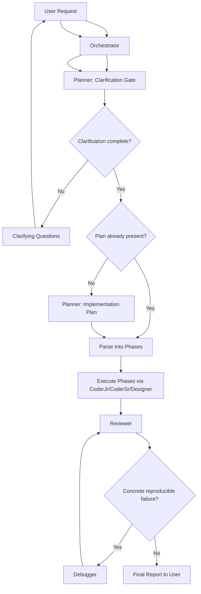

# Copilot Agentic Workflow

This repository contains an opinionated, production-oriented agentic workflow for GitHub Copilot / VS Code Agents.

Based on:
- https://gist.github.com/burkeholland/0e68481f96e94bbb98134fa6efd00436
- https://github.com/simkeyur/vscode-agents

## Repository Layout

- `agents/orchestrator.agent.md` — top-level workflow controller
- `agents/planner.agent.md` — clarification gate + implementation planning
- `agents/coder-jr.agent.md` — small/safe code tasks
- `agents/coder-sr.agent.md` — moderate/complex code tasks
- `agents/designer.agent.md` — UI/UX and accessibility work
- `agents/reviewer.agent.md` — quality/security/code review gate
- `agents/debugger.agent.md` — reproducible bug diagnosis and fixes
- `agents/skills/*/SKILL.md` — domain playbooks and checklists

## Agent Contracts

### Orchestrator
- Owns the end-to-end workflow and delegation.
- Must not implement code directly.
- Must start with Planner clarification gate.
- Must build phased execution from file overlap/dependencies.
- Must run Reviewer before completion.
- Must invoke Debugger only for concrete reproducible failures.

### Planner
- Dual role: clarification gate (Phase A) and planning (Phase B).
- Must not produce a plan until clarification is complete.
- Clarification completion signal: `Clarification complete. Proceeding to planning.`
- Must provide step-by-step plan with affected files, dependencies, risks, and open questions.
- Must not write code.

### CoderJr
- Handles straightforward tasks: small fixes, simple features, minor updates, basic tests.
- Must keep changes minimal and follow existing patterns.
- Should be first coding choice for low-complexity tasks.

### CoderSr
- Handles moderate/complex tasks, architecture-sensitive work, security/performance-critical work.
- Receives escalations from CoderJr and must continue from current state (no restart).
- Enforces stronger architectural and quality discipline.

### Designer
- Handles UI/UX, accessibility, visual hierarchy, and presentation-layer improvements.
- Must not change business logic or system behavior outside UI scope.
- Must report assumptions and accessibility notes in final output.

### Reviewer
- Performs bug/security/performance/quality review before completion.
- Must prioritize findings by severity and provide actionable, file-specific feedback.
- Must not implement fixes directly.

### Debugger
- Activated only for confirmed reproducible failures.
- Must follow reproduce -> root cause -> minimal fix -> verification flow.
- Returns control to Orchestrator/Reviewer after fix verification.

## Current Agent Workflow

1. Orchestrator starts with Planner as a clarification gate.
2. Planner either:
   - asks clarifying questions (Orchestrator relays to user and waits), or
   - confirms: `Clarification complete. Proceeding to planning.`
3. If Planner already returned a complete plan, Orchestrator proceeds; otherwise Orchestrator requests the plan from Planner.
4. Orchestrator splits plan into phases by file overlap and dependencies.
5. Orchestrator executes phase tasks via `CoderJr` / `CoderSr` / `Designer` (parallel only for non-overlapping files).
6. Orchestrator runs `Reviewer`.
7. If Reviewer/run output shows a concrete reproducible failure, Orchestrator calls `Debugger`, then routes back to `Reviewer`.
8. Orchestrator reports final result to the user.

## Mermaid Diagram

## Escalation Rules

- Start coding with `CoderJr` for simple tasks.
- Escalate to `CoderSr` when:
  - progress stalls,
  - complexity/security/performance scope increases,
  - broader architectural changes are required.
- During escalation, Orchestrator must pass:
  - original task,
  - Planner plan,
  - completed/partial `CoderJr` results,
  - triggering review/debug feedback.

## Parallelization and Conflict Rules

- Run tasks in parallel only when files do not overlap and there are no data dependencies.
- Run tasks sequentially when file overlap or dependency exists.
- Orchestrator must assign explicit file ownership in delegation prompts.

## Review and Debug Control

- Orchestrator is the controller of review/debug loop.
- Reviewer and Debugger provide findings/results; Orchestrator decides next action and completion.
- Completion should be reported only after:
  - review issues are resolved or accepted,
  - reproducible failures are debugged and re-reviewed.

## Hard Boundaries

- Orchestrator: no direct implementation.
- Planner/Reviewer: no code writing.
- Debugger: no speculative fixes without reproduction.
- Designer: no business-logic or backend/data-flow changes.
- Coders: follow repository patterns and delegated scope.

## Skills Usage Model

- Skills are domain guidance, not standalone agents.
- Coders/Reviewer should load only relevant skill files for the current task domain.
- Current skill domains:
  - API design and integration
  - Code quality and clean code
  - Data transformation and ETL
  - Database optimization
  - Frontend architecture and performance
  - Security best practices
  - Testing and QA
  - TypeScript patterns

## Design Principles

- Clear ownership and strict role boundaries.
- Parallel execution only for non-overlapping files.
- Escalation from `CoderJr` to `CoderSr` when complexity increases.
- No hidden implementation by orchestrator; delegation only.

## Notes

- Skill files are reference material for implementation quality.
- Keep agent instructions synchronized when introducing new roles or step rules.

## License

Please see the original gist for license and attribution details; this repo preserves the original orchestrator file for reference.